# Credit Risk Scorecard: Development, Validation & Monitoring

I built this project to get hands-on with credit risk modelling methodology. It follows the approach used in bank risk teams: WoE/IV feature selection, logistic regression scorecard, and the full validation and regulatory framework. It is academic work on a sample dataset, not production-grade, but it helped me understand the end-to-end lifecycle.

**Dataset:** 32,581 retail borrowers across USA, UK, and Canada. 29 features. ~22% default rate.

---

## 1. Understanding the data

Before building any model, I explored which features show clear differences between defaulters and non-defaulters.

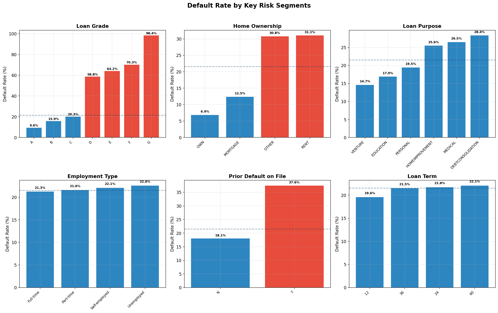

**What this shows:**
- Loan grade is the strongest separator. Grade A borrowers default at 10%, Grade G at 98%. This makes sense because grade is partially derived from creditworthiness assessment.
- Home ownership matters: renters default at 32% vs 7% for homeowners. Homeowners have more financial stability and collateral.
- Prior default on the credit bureau is a strong signal: 38% default rate vs 18% for clean records. Past behavior predicts future behavior.
- Loan purpose has moderate differences: debt consolidation and medical loans are riskier than education or venture loans.
- Country shows no meaningful difference (US, UK, Canada all around 21-22%). Same for gender, education, and marital status.

**Why this matters:** These patterns tell me where the scorecard will find its signal. They also tell me which features are safe to exclude for fair lending compliance (gender, education) because they add zero predictive value.

---

## 2. Feature selection with WoE/IV

I used Weight of Evidence and Information Value, which is the standard method for feature selection in banking scorecards. The idea: for each feature, bin the values and measure how well each bin separates good borrowers from bad ones.

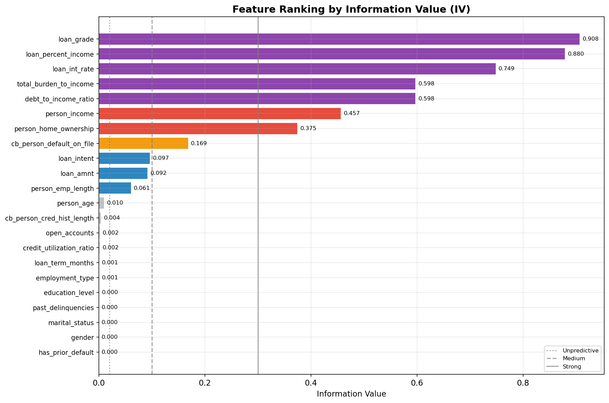

**What this shows:**
- Loan grade, loan-to-income ratio, and interest rate are the top predictors (IV > 0.5, though this high IV warrants caution about possible circularity with loan grade).
- Income and home ownership are strong predictors (IV 0.3-0.5).
- Credit bureau default flag is a medium predictor (IV = 0.17).
- Gender (IV = 0.00002), marital status, education, employment type, and past delinquencies are all unpredictive. I excluded them from the model.

**Why WoE/IV instead of generic feature importance:** Three reasons. (1) WoE handles non-linearity through binning. (2) It puts all features on the same scale, making logistic regression coefficients comparable. (3) Regulators and validators can inspect each bin, which is a requirement for production scorecards.

---

## 3. Two models: traditional scorecard vs ML benchmark

I built two models side by side to compare them, which is how model governance works in practice.

**Model A: Logistic Regression Scorecard** (the production candidate)
- This is the traditional approach used by FICO, Experian, CBS Singapore, and banks like OCBC, DBS, UOB.
- Fully interpretable: each coefficient maps directly to scorecard points.
- Regulatorily accepted for Basel III IRB PD models.

**Model B: XGBoost + SHAP** (the ML benchmark)
- Higher predictive power but harder to explain.
- SHAP provides post-hoc explainability.
- Used by fintechs; increasingly explored by banks as a performance reference.

### SHAP analysis: what drives the XGBoost model?

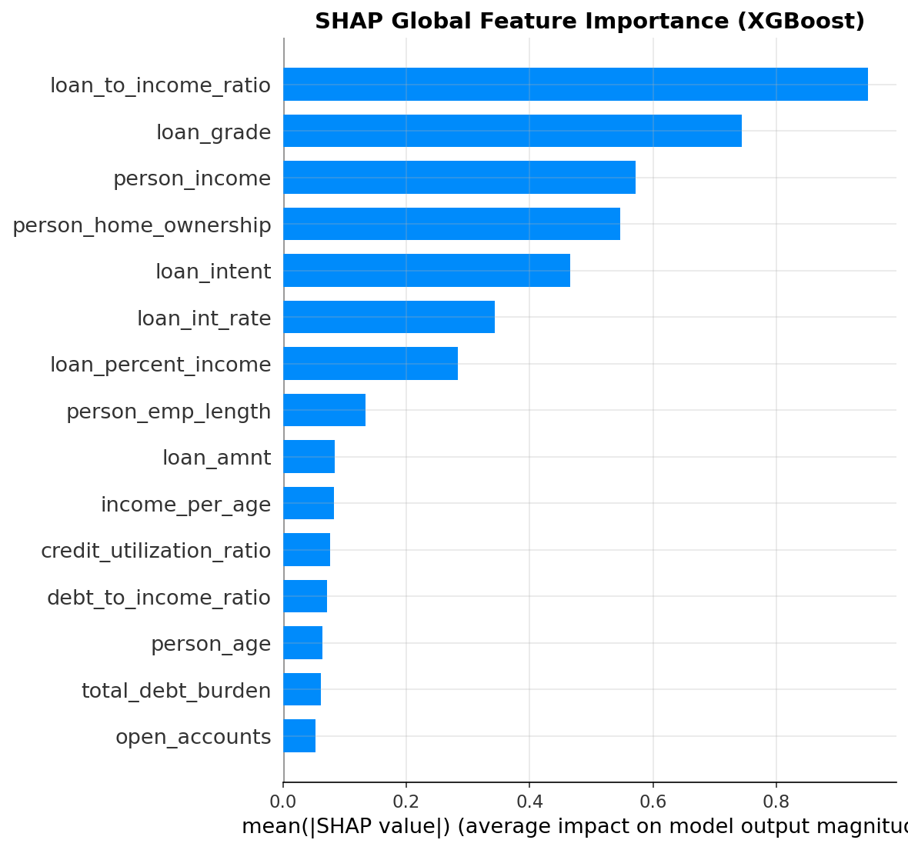

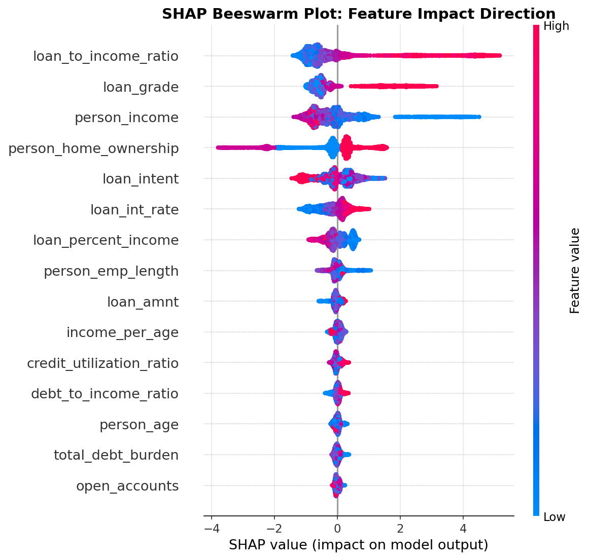

**What these show:**
- The top features for XGBoost (loan-to-income, loan grade, income, home ownership) largely agree with the IV rankings. This is an important cross-validation: it means the logistic regression scorecard is not missing critical signals.
- The beeswarm plot shows the direction of impact. For example, higher loan-to-income ratio (red dots on the right) pushes the prediction toward default. Higher income (red dots on the left for that feature) pushes away from default.

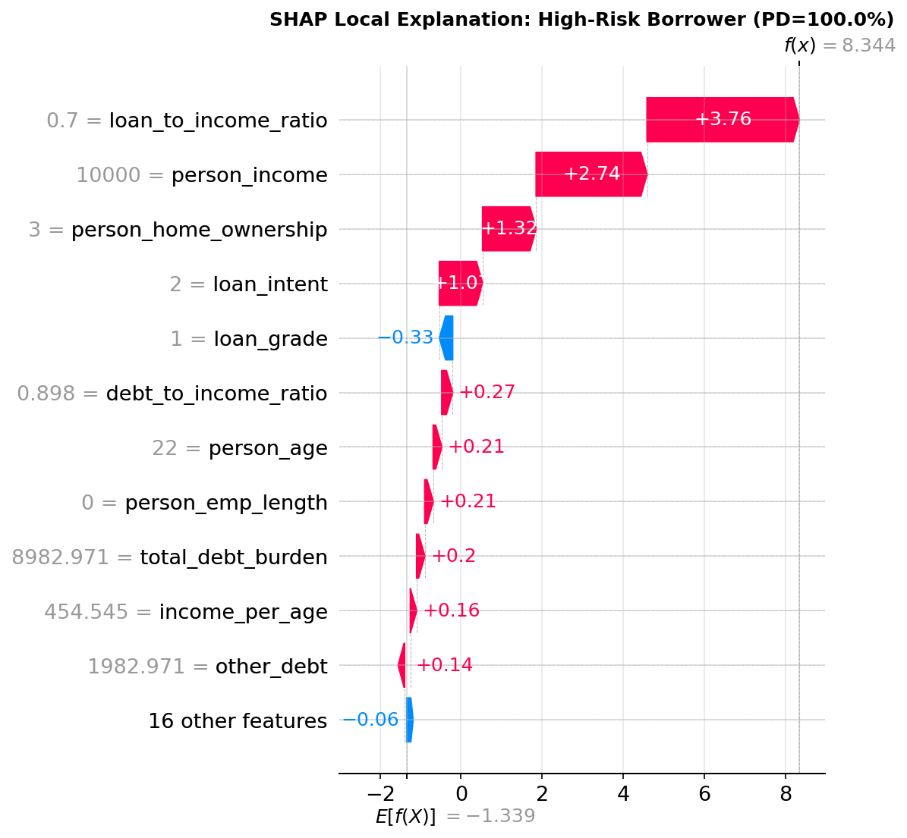

**What this shows:** For one specific high-risk borrower, SHAP breaks down exactly which features pushed the prediction toward default. This is useful for explaining individual decisions, which is a regulatory requirement in some jurisdictions.

---

## 4. Model validation

Banks evaluate credit risk models using Gini, KS, PSI, and calibration, not accuracy or AUC.

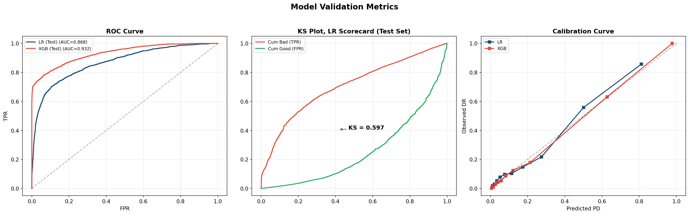

**Results:**

| Metric | LR Scorecard | XGBoost |
|--------|-------------|---------|
| Gini (test) | 73.7% | 86.4% |
| KS (test) | 59.7% | 71.7% |
| Gini gap (train-test) | 2.0% | 4.6% |
| PSI | 0.014 | 0.001 |

**What this tells me:**
- The LR scorecard achieves a Gini of 73.7%, which is strong for a retail scorecard (typical range is 40-80%).
- The XGBoost is 12.7 Gini points higher. That is the "cost of interpretability" we pay for choosing the regulatorily accepted model.
- The LR scorecard is more stable: only 2% Gini gap between train and test, vs 4.6% for XGBoost. Less overfitting risk.
- PSI of 0.014 is well below the 0.10 threshold, meaning the score distribution is stable between development and validation samples.
- The calibration curve (right panel) shows predicted PDs roughly match observed default rates. This means the PD numbers can be trusted for ECL and capital calculations.

**My recommendation:** Deploy the LR scorecard for production. Keep XGBoost as a benchmark. If the LR Gini degrades over time but XGBoost holds, it signals the linear model is becoming inadequate and redevelopment should consider non-linear approaches.

---

## 5. Basel III IRB capital

The PD from the scorecard feeds directly into the Basel III capital formula. Using the ASRF (Asymptotic Single Risk Factor) framework, I calculated how much capital the bank needs to hold for each loan.

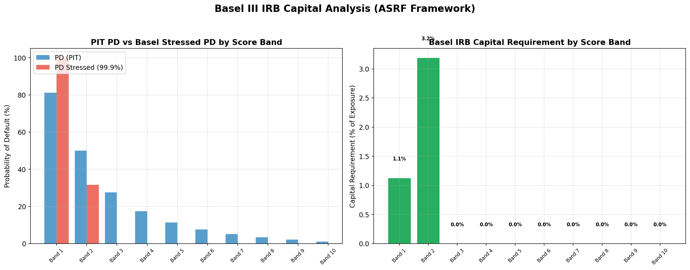

**What this shows:**
- The left panel compares the base PD (current conditions) with the stressed PD (99.9% worst-case economy scenario). For high-risk borrowers, the stressed PD is dramatically higher.
- The right panel shows the capital requirement as a percentage of exposure. Low-risk borrowers need minimal capital. High-risk borrowers can require 10%+ of the loan amount as capital.
- The logic: capital covers the gap between expected loss (average) and stressed loss (tail scenario). This is "unexpected loss" that equity must absorb.

---

## 6. IFRS 9 expected credit loss

IFRS 9 requires forward-looking provisioning. Loans are classified into three stages based on credit deterioration.

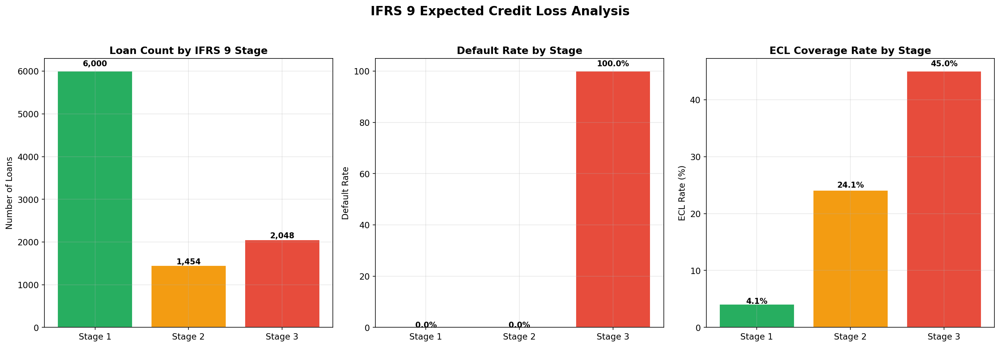

**What this shows:**
- Stage 1 (performing): 63% of the portfolio. Provision = 12-month ECL only.
- Stage 2 (watch): 15% of the portfolio. SICR (Significant Increase in Credit Risk) detected. Provision jumps to lifetime ECL, which can be 3x the Stage 1 provision even without the borrower missing a payment.
- Stage 3 (defaulted): 22% of the portfolio. Provision = LGD x EAD.

**Key difference from Basel:** IFRS 9 uses Point-in-Time PD (reflects current conditions). Basel uses Through-the-Cycle PD (long-run average). Same scorecard, same borrower, different PD adjustment depending on the purpose.

---

## 7. Stress testing

What happens to the portfolio if the economy crashes?

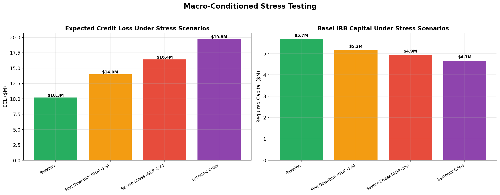

**What this shows:**
- Under the baseline scenario, ECL is $10.3M.
- Under severe stress (GDP -3%, unemployment +4%), ECL increases to $16.4M, roughly 1.6x the baseline.
- Under a systemic crisis scenario, ECL reaches $19.8M.
- This helps management assess whether the bank has enough capital to absorb losses under adverse conditions.

---

## 8. Early warning framework

Identifying borrowers with multiple risk flags before default materializes.

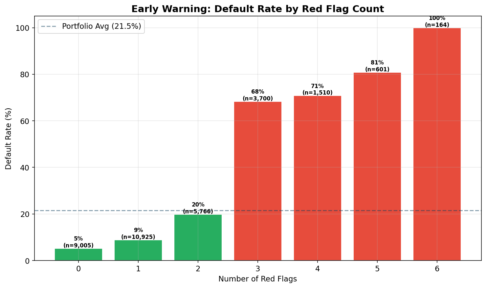

**What this shows:**
- Borrowers with 0 risk flags have a 5% default rate. With 4+ flags, it jumps to 70%+.
- Risk flags include: high DTI, high loan-to-income, high interest rate, renter status, prior default on bureau, risky loan grade.
- This can be deployed as a monthly monitoring trigger: when a borrower moves from 1 flag to 3 flags, proactive outreach should begin (restructuring offers, payment counseling).

---

## 9. Production monitoring

Building the model is half the job. The other half is monitoring it after deployment.

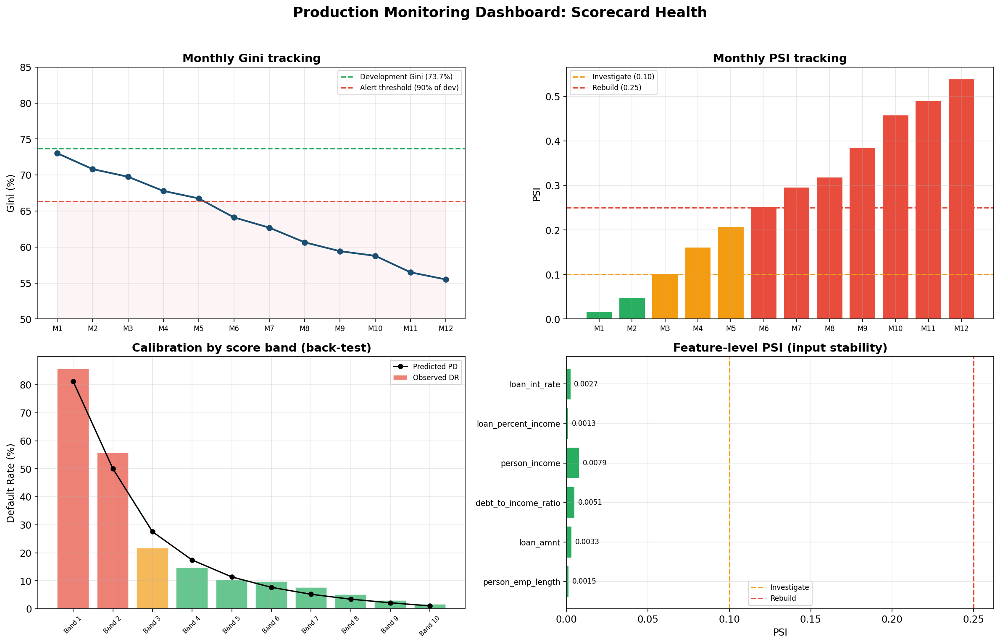

**What this shows (four panels):**
- **Top left:** Monthly Gini tracking. The green dashed line is the development Gini. The red dashed line is the alert threshold (90% of development). When Gini drops below this, the model needs review.
- **Top right:** Monthly PSI tracking. Green bars = stable. Yellow/red = population shift detected. The 0.10 and 0.25 thresholds are industry standard.
- **Bottom left:** Calibration by score band (back-testing). Bars = observed default rate, dots = predicted PD. When these diverge, the model needs recalibration.
- **Bottom right:** Feature-level PSI. Checks which specific inputs are drifting. This catches problems before the overall score PSI triggers.

**Monitoring cadence:** Monthly for Gini and PSI. Quarterly for calibration review. Annually for full back-test and redevelopment assessment.

---

## Technical details

| | |
|---|---|
| **Models** | Logistic Regression (production), XGBoost (benchmark) |
| **Validation** | Gini, KS, PSI, calibration curve, 5-fold stratified CV |
| **Stack** | Python, scikit-learn, XGBoost, SHAP, pandas, matplotlib |

**References:**
1. Basel Committee (1999). Credit Risk Modelling: Current Practices and Applications.
2. Noguer i Alonso & Sun (2025). Credit Risk Modeling for Financial Institutions. SSRN.
3. Golec & AlabdulJalil (2025). Interpretable LLMs for Credit Risk. arXiv:2506.04290.
4. Hlongwane et al. (2024). Leveraging Shapley values for interpretable credit scorecards. PLoS ONE.

## How to run

```bash
pip install -r requirements.txt
python credit_risk_scorecard.py
```

Or open `notebooks/credit_risk_scorecard.ipynb` in Jupyter/Colab.

---

## Formula Reference

All formulas used throughout the project.

### Expected Loss
```
EL = PD x LGD x EAD
```
- PD = probability of default (from the scorecard)
- LGD = loss given default (45% for unsecured retail, Basel Foundation IRB)
- EAD = exposure at default (outstanding loan amount)

### Weight of Evidence
```
WoE_i = ln(% of non-defaults in bin_i / % of defaults in bin_i)
```
- Positive WoE = more good borrowers in this bin (safer)
- Negative WoE = more bad borrowers (riskier)

### Information Value
```
IV = sum over all bins of: (% non-default_i - % default_i) x WoE_i
```
- < 0.02 unpredictive, 0.02-0.1 weak, 0.1-0.3 medium, 0.3-0.5 strong, > 0.5 suspicious

### Logistic Regression
```
log_odds = B0 + B1 x WoE_1 + B2 x WoE_2 + ... + Bn x WoE_n
PD = 1 / (1 + e^(-log_odds))
```
- B0 = intercept, B1...Bn = coefficients (both estimated from data)
- The coefficients become scorecard point weights

### Scorecard Points Conversion
```
Factor = PDO / ln(2)
Offset = Base Score - Factor x ln(Base Odds)
Score  = Offset + Factor x ln((1 - PD) / PD)
```
- Base Score = 600, Base Odds = 50:1, PDO = 20 (industry conventions)
- Points are additive because logistic regression is linear in log-odds

### Gini Coefficient
```
Gini = 2 x AUC - 1
```
- 0 = random model, 1 = perfect model
- Retail scorecards: 40-80% is typical

### KS Statistic
```
KS = max |cumulative_bad_rate(s) - cumulative_good_rate(s)|
```
- Maximum separation between cumulative distributions of defaulters vs non-defaulters

### PSI (Population Stability Index)
```
PSI = sum over all bins of: (Actual%_i - Expected%_i) x ln(Actual%_i / Expected%_i)
```
- < 0.10 stable, 0.10-0.25 investigate, > 0.25 model may need rebuilding

### Recalibration
```
log_odds_new = a + b x log_odds_old
PD_new = 1 / (1 + e^(-log_odds_new))
```
- a shifts all PDs up/down, b compresses/stretches the range
- Rank ordering is preserved (Gini and KS unchanged)

### Basel III IRB Capital (ASRF Framework)

Step 1, asset correlation (prescribed by regulator, not chosen by bank):
```
f = (1 - e^(-35 x PD)) / (1 - e^(-35))
rho = 0.03 x f + 0.16 x (1 - f)
```

Step 2, stressed PD at 99.9% confidence:
```
PD_stressed = Phi( [Phi_inv(PD) + sqrt(rho) x Phi_inv(0.999)] / sqrt(1 - rho) )
```
- Phi = standard normal CDF, Phi_inv = its inverse, Phi_inv(0.999) = 3.0902

Step 3, capital requirement:
```
K = LGD x (PD_stressed - PD)
```

Step 4, risk-weighted assets:
```
RWA = K x 12.5 x EAD
```
- 12.5 = 1/0.08 (Basel minimum capital ratio is 8%)

### IFRS 9 Expected Credit Loss

Stage 1 (performing):
```
ECL = PD_12month x LGD x EAD
```

Stage 2 (SICR detected):
```
Lifetime_PD = 1 - (1 - PD_annual)^T
ECL = Lifetime_PD x LGD x EAD
```

Stage 3 (defaulted):
```
ECL = LGD x EAD
```

Scenario-weighted final ECL:
```
ECL_final = w1 x ECL_base + w2 x ECL_upside + w3 x ECL_downside + ...
```

### Stress Testing (satellite model)
```
ln(PD_stressed / (1 - PD_stressed)) = a + b1 x GDP + b2 x unemployment + b3 x rates
```
- Coefficients estimated from historical macro-to-default data
- Each scenario plugs in different macro assumptions

---

**References:**
1. Basel Committee (1999). Credit Risk Modelling: Current Practices and Applications.
2. Noguer i Alonso & Sun (2025). Credit Risk Modeling for Financial Institutions. SSRN.
3. Golec & AlabdulJalil (2025). Interpretable LLMs for Credit Risk. arXiv:2506.04290.
4. Hlongwane et al. (2024). Leveraging Shapley values for interpretable credit scorecards. PLoS ONE.
